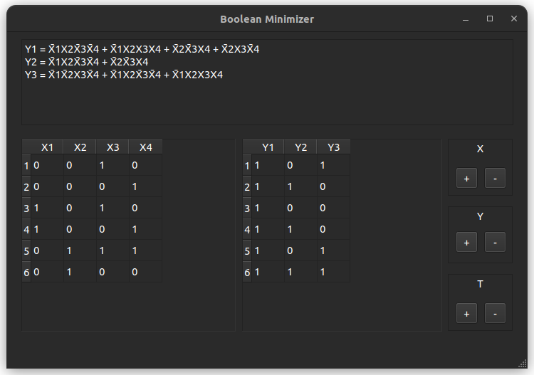

Boolean Minimizer is a GUI application to get minimal boolean functions from a truth table

# Features
- Quine-McCluskey method
- truth table scaling
- multiple input and output
- "-" symbol support

# Interface

